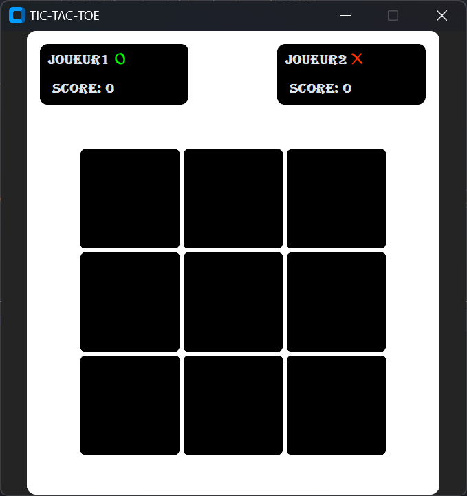
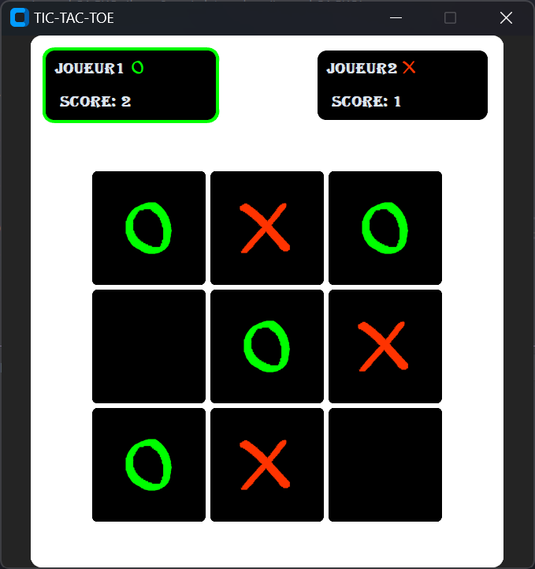

# Python TicTacToe

C’est une application développée à l’aide de la bibliothèque d'interface utilisateur graphique CustomTkinter du langage de programmation Python.
L’application s’inspire du jeu du morpion (ou tic-tac-toe). Cette version du jeu ne prend pas en compte des parties contre l’ordinateur.

## Présentation de l'application

